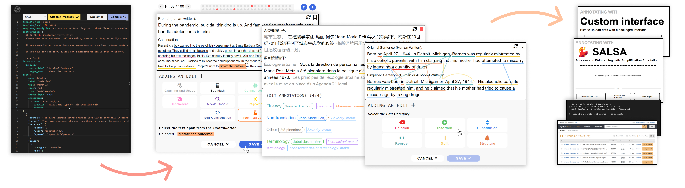
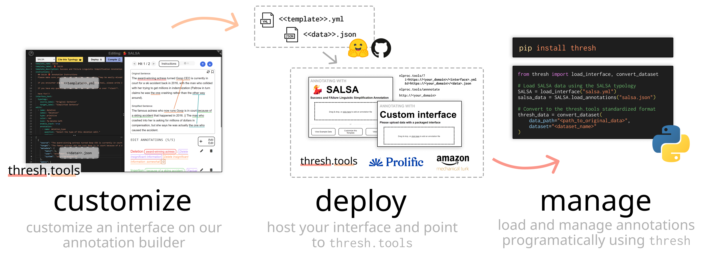
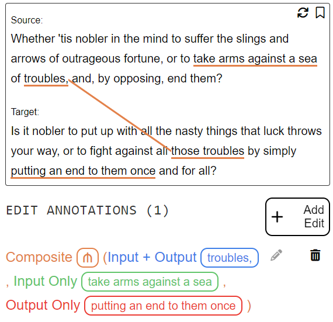
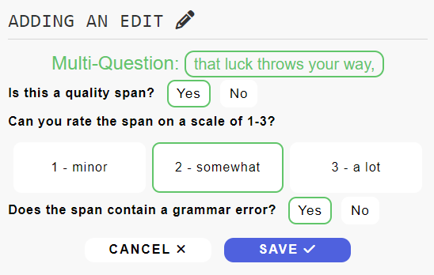
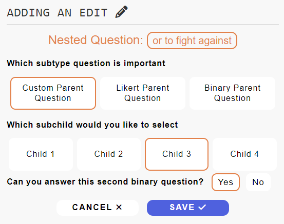
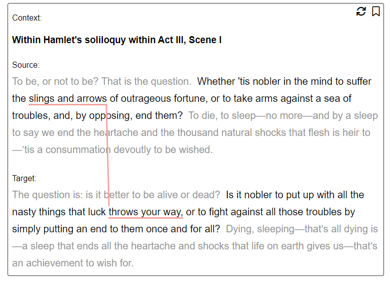
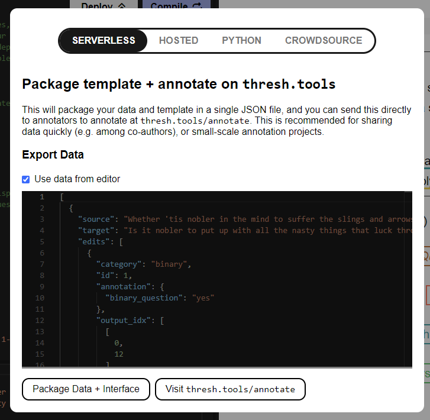
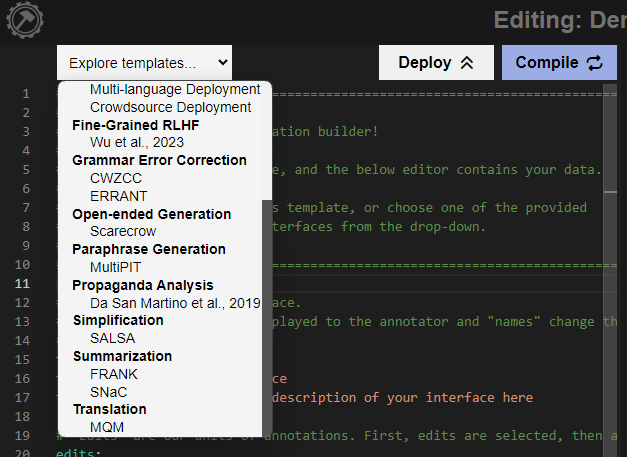

<div align="center">
    
    <!-- <h3 style="margin: 0">thresh.tools: Fine-grained evaluation for text generation</h3> -->

[**Build an Interface**](https://thresh.tools) | [**Video Tutorial**](#quick_start) | *Paper coming soon!*

<!-- | [**Paper**](https://arxiv.org/) -->
</div>
<br />
<div align="center">
    
</div>

<!-- TODO ADD GIF DEMO HERE -->

------------------------------------------------

**thresh.tools** is a platform which makes it easy to create and share fine-grained annotation. It was written specifically for complex annotation of text generation (such as [**Scarecrow**](https://thresh.tools/scarecrow) or [**SALSA**](https://thresh.tools/salsa)) and built to be universal across annotation tasks, quickly customizable and easily deployable.

<a id="quick_start"></a>

## Quick Start
Visit [**thresh.tools/demo**](https://thresh.tools/?t=demo_start) for an explanation of how our interface creation works!

https://github.com/davidheineman/thresh.tools/assets/9833172/c0ff22bf-1220-4a80-85d6-e7e8824a148f

## Getting Started with `thresh.tools`

### Overview
`thresh.tools` can be used to [***customize***](#customize) a fine-grained typology, [***deploy***](#deploy) an interface with co-authors, annotators or the research community and [***manage***](#manage) fine-grained annotations using Python. We support each step of the fine-grained annotation lifecycle:
<div align="center">
    
</div>

### Interface Customization Tutorials
These tutorials show how to customize an interface for annotation on `thresh.tools`. 

| feature | tutorial | documentation |
|:--- | :--: |  :-- | 
| Edit Types | [🔗](https://thresh.tools/?t=demo_edit_types) | [**Adding Edits**](#demo_edit_types)
| Recursive Question Trees | [🔗](https://thresh.tools/?t=demo_question_trees) | [**Annotating with Recursive Structure**](#demo_question_trees)
| Custom Instructions | [🔗](https://thresh.tools/?t=demo_instructions) | [**Add Instructions**](#demo_instructions)
| Paragraph-level Annotation | [🔗](https://thresh.tools/?t=demo_paragraph) | [**Paragraph-level Annotation**](#demo_paragraph)
| Adjudication | [🔗](https://thresh.tools/?t=demo_adjudication) | [**Multi-interface Adjudication**](#demo_adjudication)
| Disable Features | [🔗](https://thresh.tools/?t=demo_disable) | --
| Sub-word Selection | [🔗](https://thresh.tools/?t=demo_tokenization) | [**Sub-word Selection**](#demo_tokenization)
| Multi-lingual Annotation | [🔗](https://thresh.tools/?t=demo_multilingual) | [**Multi-lingual Annotation**](#demo_multilingual)
| Crowdsource Deployment | [🔗](https://thresh.tools/?t=demo_crowdsource) | [**Deploy to Crowdsource Platforms**](#demo_crowdsource)

### Deploy & Manage Annotation Tutorials
These notebook tutorials show broader usage of `thresh` for deploying to annoation platforms and managing annotations in Python:

| description | tutorial |
|:--- | :--: |
| Load data using the `thresh` library | [**load_data.ipynb**](./notebook_tutorials/load_data.ipynb) |
| Deploy an interface to the Prolific platform | [**deploy_to_prolific.ipynb**](./notebook_tutorials/deploy_to_prolific.ipynb) |
| Use `tokenizers` to pre-process your dataset | [**subword_annotation.ipynb**](./notebook_tutorials/subword_annotation.ipynb) |

<a id="customize"></a>

## Customize an Interface

All interfaces consists of two elements the *typology* and the *data*. The typology defines your interface and data defines the examples to be annotated.

`<typology>.yml`:

```yaml
template_name: my_template
template_label: My First thresh.tools Template!
edits:
    ...
```

`<data>.json`:
```json
{
    "source": "...",
    "target": "..."
}
```

<a id="demo_edit_types"></a>

### Adding Edits [↗️](https://thresh.tools/?t=demo_edit_types)

The `edits` command defines a list of edits. Each edit can be one of these types:

|  |  |  |
| :--: | :--: | :--: | 
| `type: single_span` | `type: multi_span` | `type: composite` |

Additionally, the `enable_input` and `enable_output` commands are used to enable selecting the span on the source or target sentences respectively.

|  |  |  |
|:--: | :--: | :--: |
| `enable_input: true` | `enable_output: true` | `enable_input: true` & `enable_output: true` |

To style your edits, the `icon` is any [**Font Awesome icon**](http://fontawesome.com/search?o=r&m=free) and `color` is the associated edit color. 

```yaml
edits:
  - name: edit_with_annotation
    label: "Custom Annotation"
    icon: fa-<icon>
    color: <red|orange|yellow|green|teal|blue>
    type: <single_span|multi_span|composite>
    enable_input: <true|false>
    enable_output: <true|false>
    annotation: ...
```

<a id="demo_question_trees"></a>

### Annotating with Recursive Structure [↗️](https://thresh.tools/?t=demo_question_trees)

Within each edit, the `annotation` command is used to specify the annotation questions for each edit. Using the `options` command, you can specify the question type:

|  |  |  |
| :--: | :--: | :--: | 
| `options: binary` | `options: likert-3` | `options: textbox` & `options: textarea` |

Qustions are structured as a tree, so if you list sub-questions under the `options` field, they will appear after the user has selected a certain annotation.

|  |  |  |
|:--: | :--: | :--: |
| List of children in `options` | Multiple questions in `options` | Nested sub-children in `options` |

```yaml
edits:
  - name: edit_with_annotation
    ...
    annotation:
    - name: simple_question
      question: "Can you answer this question?"
      options: <likert-3|binary|textbox|textarea>
    - name: grandparent_question
      question: "Which subtype question is important"
      options:
      - name: parent_question_1
        label: "Custom Parent Question"
        question: "Which subchild would you like to select"
        options:
      - name: child_1
        label: "Custom Child Option 1"
      - name: child_2
        label: "Custom Child Option 2"
        ...
      - name: parent_question_2
        label: "Pre-defined Parent Question"
        question: "Can you rate the span on a scale of 1-3?"
        options: <likert-3|binary|textbox|textarea>
      ...
  ...
```

<a id="demo_instructions"></a>

### Add Instructions [↗️](https://thresh.tools/?t=demo_instructions)

Using the `instructions` flag, you can add an instructions modal, or prepend the text above the interface using the `prepend_instructions` flag. Instructions are fomatted with [**Markdown**](https://www.markdownguide.org/cheat-sheet/).

<div align="center">
    
</div>

```yaml
prepend_instructions: <true|false>
instructions: |
  Your instruction text in markdown format.
```

<a id="demo_paragraph"></a>

### Paragraph-level Annotation [↗️](https://thresh.tools/?t=demo_paragraph)

To add text before or after the annotation, add the `context` and `_context_before` entries to your data JSON. The context field is formatted in [**Markdown**](https://www.markdownguide.org/cheat-sheet/), allowing for titles, subsections or code in your annotation context.

<div align="center">
    
</div>

```json
[
  {
    "context": "<context written in markdown>",
    "source_context_before": "...",
    "source": "<selectable text with context>",
    "source_context_after": "...",
    "target_context_before": "...",
    "target": "<selectable text with context>",
    "target_context_after": "...",
  }
]
```

<a id="demo_adjudication"></a>

### Multi-interface Adjudication [↗️](https://thresh.tools/?t=demo_adjudication)

To display multiple interfaces simultaneously, use the `adjudication` flag with the number of interfaces you want to show, and use `highlight_first_interface` to add a "Your Annotations" label on the first interface. 

<div align="center">
    
</div>

```yaml
adjudication: 2
highlight_first_interface: <true|false>
```

Unlike the traditional data loader (which uses the `d` parameter), you can specify multiple datasources with the `dX` parameter as such:

```
thresh.tools/?d1=<DATASET_1>&d2=<DATASET_2>
```

<a id="demo_tokenization"></a>

### Sub-word Selection [↗️](https://thresh.tools/?t=demo_tokenization)

To allow a smoother annotation experience, the span selection will "snap" to the closest word boundary. This boundary is `word` by default, but can also be defined as such:

<!-- TODO: ADD SCREENSHOT -->

For a guide on pre-processing your dataset, please see [**notebook_tutorials/subword_annotation.ipynb**](./notebook_tutorials/subword_annotation.ipynb).

```yaml
tokenization: <word|char|tokenized>
```

<a id="demo_multilingual"></a>

### Multi-lingual Annotation [↗️](https://thresh.tools/?t=demo_multilingual)

Any text in our interface can be overriden by specifying its source using the `interface_text` flag. We create templates for different languages which can be used the `language` flag.

For a full list of interface text overrides, please reference a [**langauage template**](./public/lang/en.yml).

```yaml
language: <zh|en|es|hi|pt|bn|ru|ja|vi|tr|ko|fr|ur>
interface_text:
  typology:
    source_label: "莎士比亚"
    target_label: "现代英语"
  ...
```

Looking to expand our language support? See our section on [**contributing**](#language_contribute).

<a id="deploy"></a>

## Deploy an Interface

Please reference the "Deploy" modal within [**the interface builder**](https://thresh.tools/) for more detail!

<div align="center">
    
</div>

<!-- ### Share with Co-authors

### Share Your Interface Publically -->

<a id="demo_crowdsource"></a>

### Deploy to Crowdsource Platforms [↗️](https://thresh.tools/?t=demo_crowdsource)

Use the `crowdsource` command to specify a "Submit" button at the end of annotation. Please see [**notebook_tutorials/deploy_to_prolific.ipynb**](./notebook_tutorials/deploy_to_prolific.ipynb) for a full guide on deploying an interface programatically.

```yaml
crowdsource: <prolific>
prolific_completion_code: "XXXXXXX"
```

<a id="manage"></a>

## Manage Data with the `thresh` Library
```sh
pip install thresh
```

### Loading Annotations
To load annotations, simply load your JSON data and call `load_annotations`:

```python
from thresh import load_interface

# Serialize your typology into a class
YourInterface = load_interface(
    "<path_to_typology>.yml"
)

# Load & serialize data from <file_name>.json
thresh_data = YourInterface.load_annotations(
    "<file_name>.json"
)
```

For example, using the SALSA demo data:
```python
from thresh import load_interface

# Load SALSA data using the SALSA typology
Salsa = load_interface("salsa.yml")
salsa_data = Salsa.load_annotations("salsa.json")

print(salsa_data[0])
>> SalsaEntry(
>>   annotator: annotator_1, 
>>   system: new-wiki-1/Human-2-written, 
>>   source: "Further important aspects of Fungi ...", 
>>   target: "An important aspect of Fungi in Art is ...", 
>>   edits: [
>>     DeletionEdit(
>>       input_idx: [[259, 397]], 
>>       annotation: DeletionAnnotation(
>>         deletion_type: GoodDeletion(
>>           val: 3
>>         ), 
>>         coreference: False, 
>>         grammar_error: False
>>       ),
>>     ), 
>>     ...
>>   ]
>> )
```

To prepare a dataset for annotation, simply export your `List[Annotation]` object and call `export_data`:
```python
# Export data to <file_name>.json for annotation
YourInterface.export_data(
    data=thresh_data,
    filename="<file_name>.json"
)
```

For a full tutorial with examples and advanced usage, please see [**/notebook_tutorials/load_data.ipynb**](./notebook_tutorials/load_data.ipynb).

### Internal Data Classes
Our data loading code is backed by custom internal classes which are created based on your typology. You can access these classes directly:
```python
from thresh import get_entry_class

# Get the custom data class for the SALSA typology
Salsa = load_interface("salsa.yml")
SalsaEntry = Salsa.get_entry_class()

# Create a new entry
custom_entry = SalsaEntry(
    annotator = annotator_1, 
    system = new-wiki-1/GPT-3-zero-shot, 
    target = The film has made more than $552 million at the box office and is currently the eighth most successful movie of 2022., 
    source = The film has grossed over $552 million worldwide, becoming the eighth highest-grossing film of 2022.
)

print(custom_entry.system)
>> new-wiki-1/GPT-3-zero-shot
```

## Data Conversion
Our `thresh` data format is meant to be universal across fine-grained annotation tasks. To show this, we have created conversion scripts from exisitng fine-grained typologies. Use the `thresh` library to convert from existing data formats:

```sh
pip install thresh
```

To convert to our standardized data format, our library includes bi-directional conversion from existing fine-grained annotation typologies:

```python
from thresh import convert_dataset

# To convert to the thresh.tools standardized format:
thresh_data = convert_dataset(
    data_path="<path_to_original_data>", 
    dataset="<dataset_name>"
)

# To convert back to the original format:
original_data = convert_dataset(
    data=thresh_data, 
    dataset="<dataset_name>", 
    reverse=True
)
```

We support conversion for the following datasets:
```
frank, scarecrow, mqm, snac, fg-rlhf, propaganda
```

### Demo Data Sources

In the table below you can find all the original data for each interface. For our demo data, we randomly selected 50 annotations from each dataset. We include the file names of the specific datsets we use below, selecting from the test set when applicable:

| interface | data | implementation | file name |
|:--- | :--: | :--- | :---: |
| FRANK | [🔗](https://github.com/artidoro/frank) | [**thresh.tools/frank**](https://thresh.tools/frank) | `human_annotations.json` |
| Scarecrow | [🔗](https://yao-dou.github.io/scarecrow) | [**thresh.tools/scarecrow**](https://thresh.tools/scarecrow) | `grouped_data.csv` |
| MQM | [🔗](https://github.com/google/wmt-mqm-human-evaluation) | [**thresh.tools/mqm**](https://thresh.tools/mqm) | `mqm_newstest2020_ende.tsv` |
| SALSA | [🔗](https://github.com/davidheineman/salsa) | [**thresh.tools/salsa**](https://thresh.tools/salsa) | `salsa_test.json` |
| SNaC | [🔗](https://github.com/tagoyal/snac) | [**thresh.tools/snac**](https://thresh.tools/snac) | `SNaC_data.json` |
| arXivEdits | [🔗](https://github.com/chaojiang06/arXivEdits) | [**thresh.tools/arxivedits**](https://thresh.tools/arxivedits) | `test.json` |
| Wu et al., 2023 | [🔗](https://github.com/allenai/FineGrainedRLHF) | [**thresh.tools/fg-rlhf**](https://thresh.tools/fg-rlhf) | `dev_feedback.json` |
| Da San Martino et al., 2019 | [🔗](https://propaganda.qcri.org/) | [**thresh.tools/propaganda**](https://thresh.tools/propaganda) | `test/article<X>.labels.tsv` |

We do not create dataloaders for the following interfaces:

| interface | reason |
|:---: | :-- |
| MultiPIT | This is an inspection interface, examples are taken from Table 7 of the [**MultiPIT paper**](https://aclanthology.org/2022.emnlp-main.631). |
| CWZCC | The example is taken from App. B of the [**CWZCC paper**](https://aclanthology.org/2020.lrec-1.327). Full dataset is not publically available due to copyright and privacy concerns. |
| ERRANT | Our example data is taken from the annotations from the [**W&I+LOCNESS corpus**]() collected by [**Bryant et al., 2019**](https://aclanthology.org/W19-4406/) from original exerpts from [**Yannakoudakis et al., 2018**](https://www.tandfonline.com/doi/abs/10.1080/08957347.2018.1464447) and [**Granger, 1998**](https://www.learnercorpusassociation.org/resources/tools/locness-corpus/). The dataset was released as part of the [**Building Educational Applications 2019 Shared Task**](https://www.cl.cam.ac.uk/research/nl/bea2019st/#data). |

## Contributing

<a id="local"></a>

### Set Up `thresh.tools` Locally
Clone this repo: 
```sh
git clone https://github.com/davidheineman/thresh.git
```

Set up Vue: 
```sh
npm install
npm run dev     # To run a dev environment
npm run build   # To build a prod environment in ./build
npm run deploy  # Push to gh-pages
```

Deployment will create a `gh-pages` branch. You will need to go into GitHub Pages settings and set the source branch to `gh-pages`.

### Submit a New Typology
You do *not* need to do this if you want to use your interface (please see [**Deploy an Interface**](#deploy)). This will add your interface to the `thresh.tools` homepage!

<div align="left">
    
</div>

To make your interface available in the `thresh.tools` builder, please clone this repo and submit a pull request with the following:

1. Add your typology YML file to [**public/templates/**](./public/templates/).
2. Add your demo data JSON file to [**public/data/**](./public/data/). We encourage authors to submit a sample of 50 examples for their full dataset, but this is not required.
3. Modify [**src/main.js**](./src/main.js) to link to your dataset, by adding a line to `templates`:

    ```js
    const templates = [
        { name: "SALSA", path: "salsa", task: "Simplification", hosted: true },
        { name: "Scarecrow", path: "scarecrow", task: "Open-ended Generation", hosted: true },
        ...
        { name: "<display_name>", path: "<your_interface>", task: "<your_task>", hosted: true }
    ]
    ```
    In this case `<your_task>` will correspond to the task you are grouped with. *Note: You can preview your changes by setting up [**thresh.tools locally**](#local)!*
4. Submit a [**pull request**](https://docs.github.com/en/pull-requests/collaborating-with-pull-requests/proposing-changes-to-your-work-with-pull-requests/creating-a-pull-request) with your changes! Then we will merge with the `thresh.tools` main branch. Please reach out if you have any questions.

<a id="language_contribute"></a>

### Add Language Support
Multi-lingual deployment is core to `thresh.tools`, and we are actively working to add support for more languages. If you would like to add support for a new language (or revise our existing support), our language templates are located in [**public/lang/**](./public/lang/).
- To add support for a new language, simply create a new `.yml` using the structure of an [**existing language template**](./public/lang/en.yml).
- To revise an existing template, simply make changes within the template.

When you are finished, please submit a [**pull request**](https://docs.github.com/en/pull-requests/collaborating-with-pull-requests/proposing-changes-to-your-work-with-pull-requests/creating-a-pull-request) with your changes.

### Set Up the `thresh` Python Library
Clone this repo: 
```sh
git clone https://github.com/davidheineman/thresh.git
cd data_tools
```

Make any changes to the library and push to PyPi:
```sh
rm -r dist 
python -m build
python -m twine upload --repository pypi dist/*
```

## Cite `thresh.tools`
If you find our library helpful, please consider citing our work:
```
@citation{
    coming soon!
}
```
